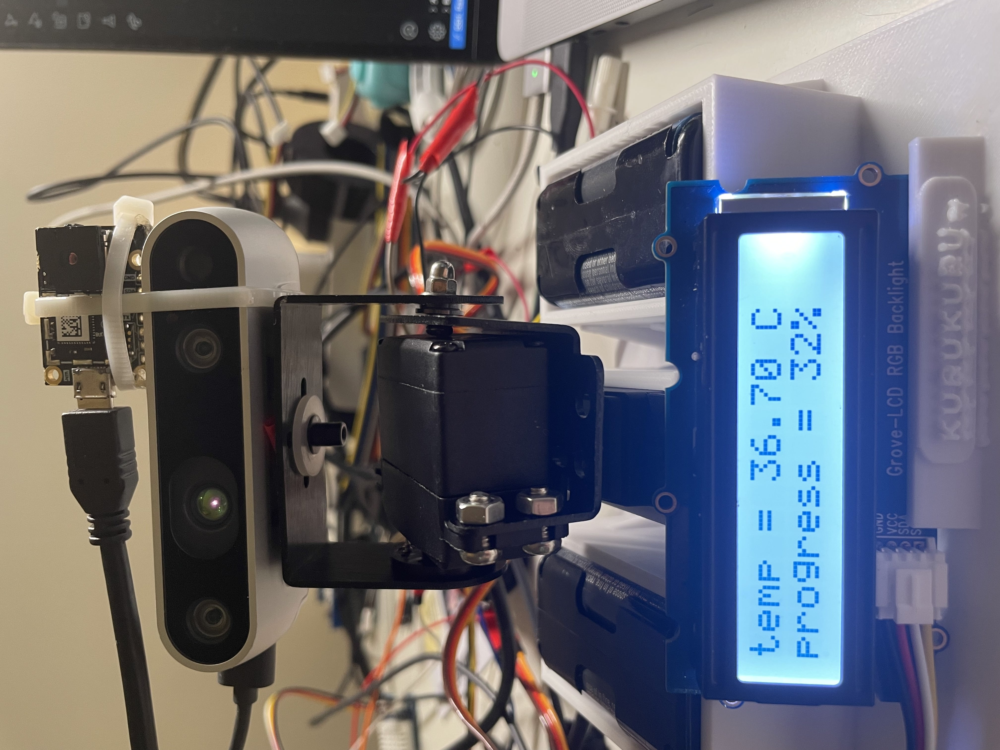

# Human Fever Monitoring System Based on Raspberry Pi and Thermal Sensor

[**Project Proposal**](https://github.com/Zeal-L/Human-Fever-Monitoring-System/blob/539541d9d77aef8cc5e4250bac093d20168796bc/Project%20Proposal.pdf)

[**Project Progress Report**](https://github.com/Zeal-L/Human-Fever-Monitoring-System/blob/539541d9d77aef8cc5e4250bac093d20168796bc/Project%20Progress%20Report.pdf)

[**Project FInal Report**](https://github.com/Zeal-L/Human-Fever-Monitoring-System/blob/539541d9d77aef8cc5e4250bac093d20168796bc/FInal%20Report.pdf)
